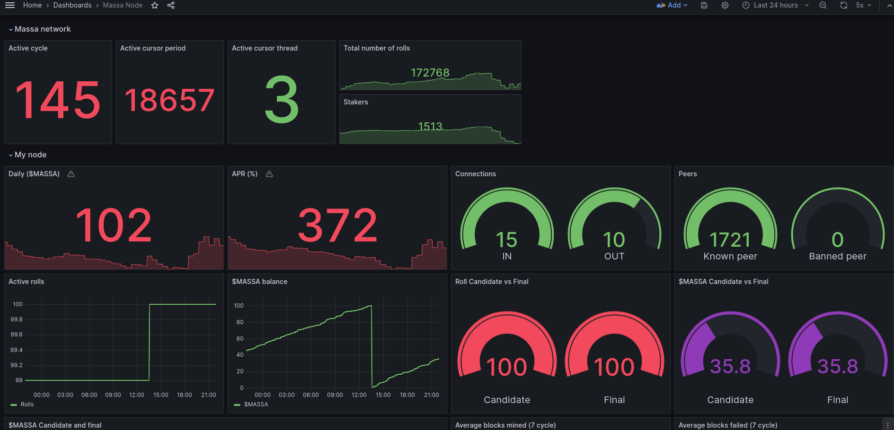

# Dockerized Massa node #
**Last build for Massa node version MAIN.2.3**

## Features
  * Easy import your wallet from private key or .yaml file
  * Autocompound MAS rewards
  * Set a target roll amount
  * Persistent storage
  * Auto update of your public IP (usefull for connections with dynamic ip)
  * All docker features ( run in background, persistent logs, always restart)

## Quick install wizard

  This script will install and run a Massa node. Buying rolls and start staking right away. Yes my friend!

 1. Download the installer
   ```bash
   curl -fsSL https://raw.githubusercontent.com/peterjah/massa-core-docker/main/install.sh -o install-massa.sh
   ```

 2. Run the installer
   ```bash
   sudo sh install-massa.sh
   ```
   * The script will install docker and setup your docker compose file
   * If you wish to import a wallet from a private key, the script will setup it for you.

## Manual install

#### Requirements
  * Install docker and docker-compose on your system

### How to setup

  * Create a `docker-compose.yml` file. Copy the provided content below, and customize it by adding your specific environment variables.
  * WALLETPWD is mandatory. It is the password to unlock your wallet. If you are importing wallet from private key, this password will be used to encrypt wallet backup file

#### Import wallet from .yaml file
  * Create a `massa_mount` folder next to your `docker-compose.yml` file. Put your wallet .yaml file in it. That's it!

#### Import wallet from private key
  * set WALLET_PRIVATE_KEY variable to import a wallet from its private key. It will be loaded at node startup.

```yaml
# docker-compose.yml
version: '3'
services:

  massa-core:
    image: peterjah/massa-core
    container_name: massa-core
    restart: always
    environment:
      - WALLETPWD=
    # use this to import wallet from private key
    # - WALLET_PRIVATE_KEY=
      - MINIMAL_FEE=0
    ports:
     - "31244:31244"
     - "31245:31245"
     - "33035:33035"
     #- "31248:31248" prometheus metrics port. Uncomment to use with grafana dashboard
    cap_add:
      - SYS_NICE
      - SYS_RESOURCE
      - SYS_TIME
    volumes:
     - ./massa_mount:/massa_mount

    # Uncomment this to activate auto updates
    # watchtower:
    #   image: containrrr/watchtower
    #   container_name: watchtower
    #   volumes:
    #     - /var/run/docker.sock:/var/run/docker.sock
    #   command: --stop-timeout 360s --interval 300 massa-core

volumes:
  massa-core:
```
#### Available options:

 - `MINIMAL_FEE`: Configure the minimal fee to be included in operation. Below this, the node will reject the operation. Massa node default is 0.01MAS 
 - `DYNIP`: Set to "1" if you host under dynamic public IP. Disabled by default.
 - `WALLETPWD`: Password used to encrypt wallet yaml file.
 - `WALLET_PRIVATE_KEY`: Optional. Private key to import
 - `NODE_MAX_RAM`: The app node will auto restart if RAM usage goes over this % threshold. Default to 99%.
 - `TARGET_ROLL_AMOUNT`: The max number of rolls you want to hold. It will buy or sell rolls according your MAS balance and the targeted amount. If not provided the rewards will be automatically compound (i.e node will buy a roll as soon as wallet as 100MAS).

### Manage your node:

  * Start the container in detached mode:
```bash
sudo docker compose up -d
```

  * Stop the container in detached mode:
```bash
sudo docker compose down
```

  * Update your node to latest version and restart it:
```bash
sudo docker compose pull && sudo docker compose up -d
```

  * See the node logs:
```bash
sudo docker compose logs
```

  * Filter to get only Massa-guard logs:
```bash
sudo docker compose logs | grep Massa-Guard
```

  * To enter your container:
```bash
sudo docker exec -it massa-core /bin/bash
```

  * Using massa client to get node status:
```bash
sudo docker exec -t massa-core massa-cli get_status
```

  * Using massa client to get your wallet info:
```bash
sudo docker exec -t massa-core massa-cli wallet_info
```


### Dashboard

  * Dockprom stack to monitor your node.
  see https://github.com/enzofoucaud/dockmas




### Log rotation
  Logs from your running docker will accumulate with the time. To avoid the disk to be full, you can setup log rotation at Docker level.

  Create or edit the file `/etc/docker/daemon.json`
  ```json
  {
    "log-driver": "local",
    "log-opts": {
      "max-size": "15m",
      "max-file": "5"
    }
  }
```

### Automated update
We recommend the use of watchtower to automagically pull the latest version of the docker image when available. Just add the following lines to add a new service in your docker-compose file:
```yaml
...
  watchtower:
    image: containrrr/watchtower
    container_name: watchtower
    volumes:
      - /var/run/docker.sock:/var/run/docker.sock
    command: --stop-timeout 360s --interval 300 massa-core
...
```

### IPV6

IPV6 is disabled by default.
To enable it in massa node edit the `massa_mount/node_config-<version>.toml` file. Set the `bootstrap_protocol` field under bootstrap section to "Both"

This part is highly experimental and has not been actively tested.

- Create or edit your host /etc/docker/daemon.json to add:
```json
{
  "ipv6": true,
  "fixed-cidr-v6": "fd00::/80"
}
```
- Restart docker service to reload config setting
- Allow MASQUERADE for ipv6
```console
ip6tables -t nat -A POSTROUTING -s fd00::/80 ! -o docker0 -j MASQUERADE
```
- Create a container which dynamicaly edit your iptables rules for port redirection
```console
docker run -d --restart=always -v /var/run/docker.sock:/var/run/docker.sock:ro --cap-drop=ALL --cap-add=NET_RAW --cap-add=NET_ADMIN --cap-add=SYS_MODULE --net=host --name ipv6nat robbertkl/ipv6nat
```

## [THANKS] ##
Thanks to **fsidhoum** and **dockyr** for help
